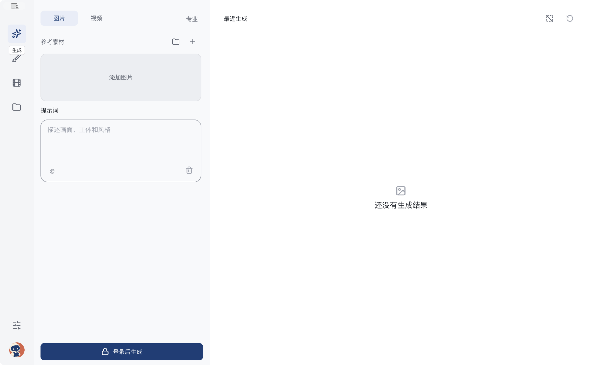
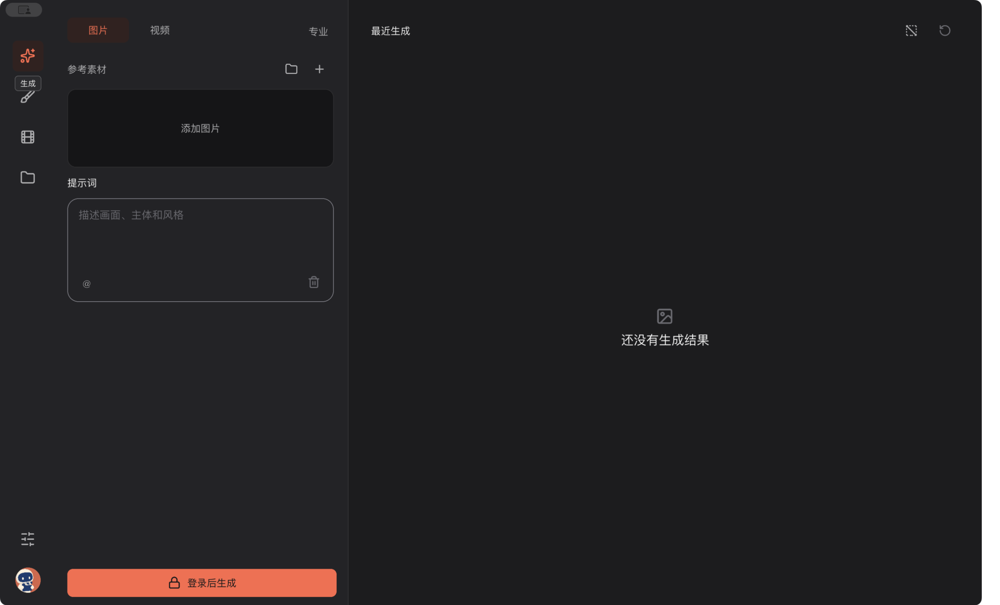
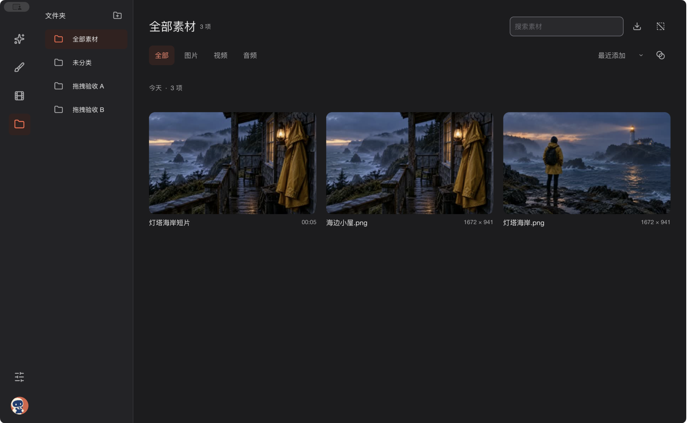
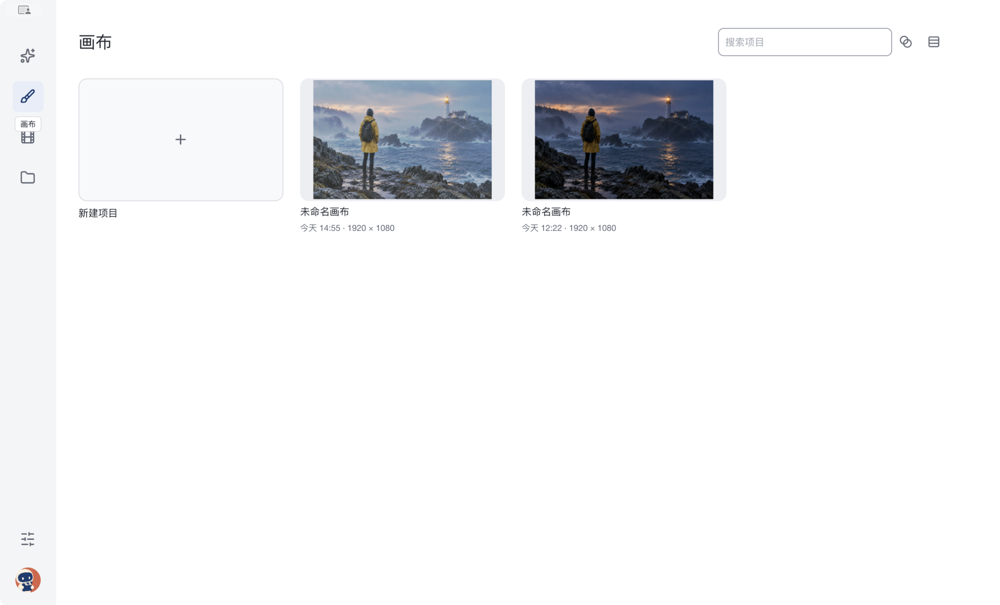
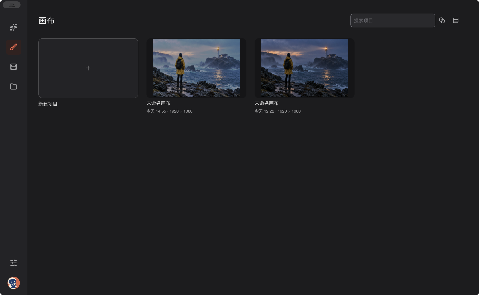
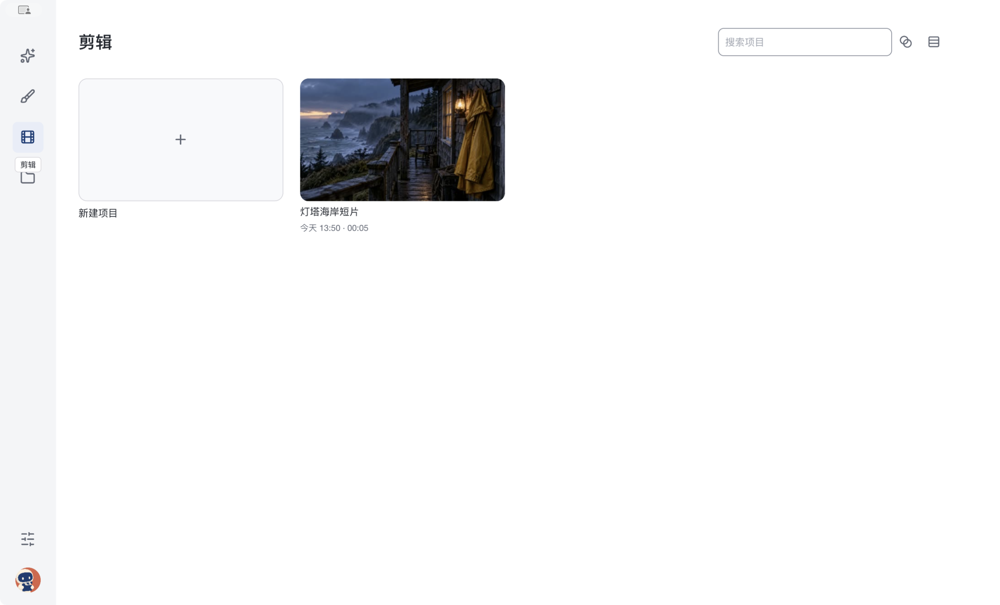
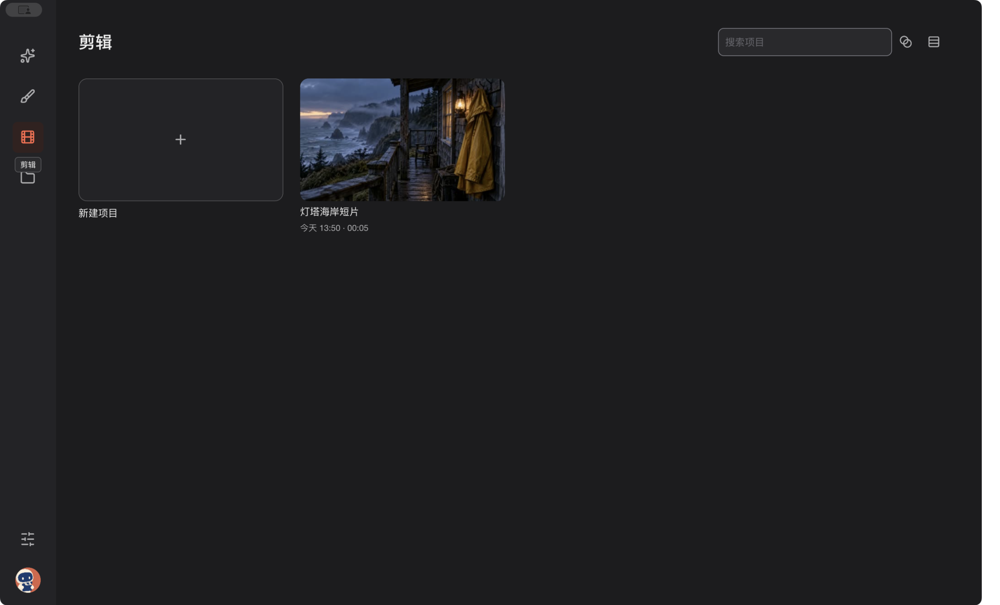

# Seecut

[简体中文](README.md) · [English](README.en.md)


Seecut 是桌面创作工作台。你可以从提示词和参考素材开始生成，也可以直接导入本地素材，在画布或剪辑工程里继续创作。

## 界面

以下是 macOS 候选包的原生运行截图，使用公开演示素材。生成页展示未登录状态，没有执行在线生成。

| 浅色 | 深色 |
| --- | --- |
|  |  |
|  |  |
|  |  |
|  |  |

## 创作流程

1. 在「生成」选择快速或专业模式，填写提示词、加入参考素材。在线生成需要登录及服务连接。
2. 在「资产库」整理本地素材和已保存的生成结果，按文件夹查找，并送入画布或剪辑工程。
3. 在「画布」编辑图片与图层；在「剪辑」将片段加入素材区、安排时间线并导出。

本地素材管理、画布和剪辑可离线使用。可用的在线模型和费用以应用内当次显示为准。

## 安装与构建

macOS 用户取得本项目构建的 `Seecut-macos.zip` 后，解压并将 `Seecut.app` 移入「应用程序」。当前仓库尚未提供公开下载包。

从源码运行需要 Rust 1.93、Xcode Command Line Tools、CMake、C++ 工具链和 FFmpeg 7+ 开发库：

```sh
cd src
cargo run --profile quick -p concat
```

要打包 macOS 应用，在上一步的 `src` 目录构建 release 版，再回到仓库根目录运行脚本：

```sh
cargo build --release -p concat
cd ..
SEECUT_INSTALL=0 ./scripts/make-app.sh
```

产物位于仓库同级的 `outputs/`。构建细节见 [源码说明](src/README.md)。

目前主要在 macOS Apple Silicon 上验证；其他桌面平台的 Seecut 候选包仍需实机验收。具体检查与限制见 [实现核对记录](docs/SEECUT-FIGMA-IMPLEMENTATION-QA.md)。

## 反馈与许可

欢迎在本仓库提交问题或 PR。反馈问题时请附操作步骤、系统版本和可脱敏的截图或日志。

本仓库代码沿用 [AGPL-3.0-or-later](LICENSE)；附加授权与第三方声明见 [LICENSE-EXCEPTIONS.md](LICENSE-EXCEPTIONS.md) 和 [THIRD_PARTY_NOTICES.md](THIRD_PARTY_NOTICES.md)。Seecut 基于 [Concat](https://github.com/jub0t/Concat) 的 Rust／Slint 桌面应用代码，并保留上游作者及贡献者版权声明。图片画布中的部分实现移植自 Robbie Tilton 的 [Compositor](https://github.com/robbietilton/Compositor)（MIT）。
